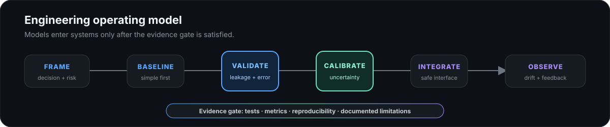

<div align="center">


<br />

<a href="mailto:ehmedmanafoghlu@gmail.com">
  
</a>
<a href="https://www.linkedin.com/in/ahmad-abdullayev-826816289/">
  
</a>
<a href="https://github.com/ahmadabdullayew">
  
</a>


</div>

## Engineering profile

I am a Computer Engineering student focused on building machine-learning systems that remain understandable **after** the model leaves the notebook.

<table>
<tr>
<td width="50%" valign="top">

### What I build

- applied machine-learning services;
- reproducible evaluation pipelines;
- human-in-the-loop decision workflows;
- research-oriented engineering prototypes.

</td>
<td width="50%" valign="top">

### What I optimize for

- correctness before complexity;
- validation before confident claims;
- visible failure modes;
- typed, testable system boundaries;
- evidence that another engineer can inspect.

</td>
</tr>
</table>

> **Engineering thesis:** a model is not a system, and a metric is not evidence until the evaluation design, assumptions, limitations, and execution path can be inspected.

## Selected systems

<table>
<tr>
<td width="50%" valign="top">

### [ASANAppeal AI](https://github.com/ahmadabdullayew/Asan-Appeal)

**Runnable backend foundation · Civic AI**

Complaint intake, institutional routing, priority scoring, appeal drafting, response verification, explanation generation, and human-review fallback.

The implementation includes role-based access, SQLite persistence, evidence storage, append-only audit logging, privacy controls, abuse protection, and operational observability.

`Python` `FastAPI` `SQLite` `Human review`

</td>
<td width="50%" valign="top">

### [EO Drought Intelligence](https://github.com/ahmadabdullayew/EO-Drought-Intelligence)

**Hackathon prototype · Earth observation**

A layered Python system that turns Earth-observation and environmental signals into drought analysis, temporal stress indicators, and irrigation-priority outputs.

The architecture separates ingestion, processing, analytics, model development, evaluation, inference, and interfaces.

`Python` `EO data` `ML pipelines` `Decision support`

</td>
</tr>
<tr>
<td width="50%" valign="top">

### [Neural Branch-and-Bound](https://github.com/ahmadabdullayew/DBMS-Report)

**Formal technical report · Learning-augmented optimization**

An exact database physical-design accelerator combining branch-and-bound, column generation, and cutting planes.

Learned proposals remain advisory; deterministic acceptance gates preserve solver correctness and exactness.

`Optimization` `Database systems` `Research design`

</td>
<td width="50%" valign="top">

### [Personal Academic Website](https://github.com/ahmadabdullayew/personal-academic-website)

**Implementation foundation · Evidence-governed software**

A Django-based academic platform with reproducible Python and Node toolchains, architecture decisions, governance controls, strict quality gates, and a production deployment design.

The public surface is intentionally narrow until personal and academic claims have approved source records.

`Django` `TypeScript` `PostgreSQL` `Testing`

</td>
</tr>
</table>

## Operating model



## Technical foundation

<p align="center">
  
  
  
  
  
  
  
  
  
  
  
  
</p>

<table>
<tr>
<td width="33%" valign="top">

### Building

- reproducible ML evaluation;
- accountable review workflows;
- production-minded Python services.

</td>
<td width="33%" valign="top">

### Studying

- proof-based mathematics;
- probability and statistics;
- optimization and algorithms.

</td>
<td width="33%" valign="top">

### Seeking

- ML engineering internships;
- research collaboration;
- rigorous open-source work.

</td>
</tr>
</table>

## Evidence standard

```text
prototype    != production
activity     != competence
complexity   != rigor
confidence   != calibration
automation   != accountability
```

Every important claim should terminate in at least one inspectable artifact:

`code` · `tests` · `metrics` · `reproducible commands` · `design decisions` · `documented limitations`

---

<div align="center">

### Build systems that can be measured, explained, and trusted.

[Email](mailto:ehmedmanafoghlu@gmail.com) ·
[LinkedIn](https://www.linkedin.com/in/ahmad-abdullayev-826816289/) ·
[Selected work](#selected-systems)

</div>
