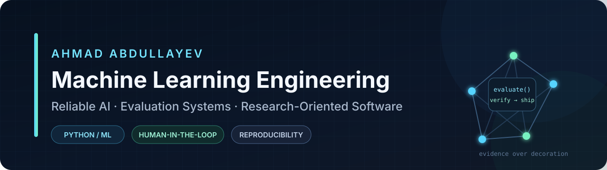

<div align="center">



<br />

**Computer Engineering student building reliable machine-learning systems and research-oriented software.**

I work across applied machine learning, rigorous evaluation, human-in-the-loop AI, and production-minded Python systems. My long-term direction is reliable AI for high-consequence domains, particularly healthcare.

[Portfolio](https://github.com/ahmadabdullayew/personal-academic-website) ·
[GitHub](https://github.com/ahmadabdullayew) ·
[Email](mailto:ehmedmanafoghlu@gmail.com)

</div>

---

## Selected Systems

<table>
<tr>
<td width="50%" valign="top">

### [ASANAppeal AI](https://github.com/ahmadabdullayew/Asan-Appeal)

A civic-AI workflow for structured complaint intake, routing, priority estimation, response verification, human review, privacy controls, and auditability.

**Engineering signal**

`Applied AI` `FastAPI` `Verification` `Human review`

</td>
<td width="50%" valign="top">

### [EO Drought Intelligence](https://github.com/ahmadabdullayew/EO-Drought-Intelligence)

An Earth-observation prototype that converts satellite and environmental data into drought analysis and irrigation-priority intelligence.

**Engineering signal**

`Geospatial ML` `Environmental data` `Analytics` `Pipelines`

</td>
</tr>

<tr>
<td width="50%" valign="top">

### [Neural Branch-and-Bound](https://github.com/ahmadabdullayew/DBMS-Report)

A research-oriented design for learning-augmented exact optimization in database physical design, with deterministic acceptance gates preserving solver correctness.

**Engineering signal**

`Optimization` `Branch-and-bound` `Research design` `Exactness`

</td>
<td width="50%" valign="top">

### [Personal Academic Website](https://github.com/ahmadabdullayew/personal-academic-website)

A reproducible academic portfolio platform with structured architecture, testing, documentation, governance, and deployment controls.

**Engineering signal**

`Django` `PostgreSQL` `TypeScript` `Architecture`

</td>
</tr>
</table>

---

## Engineering Profile

<table>
<tr>
<td width="33%" valign="top">

### Machine Learning

- classical ML pipelines;
- leakage-resistant validation;
- calibration and abstention;
- error analysis;
- model comparison;
- human-in-the-loop evaluation;
- provenance and reproducibility.

</td>
<td width="33%" valign="top">

### Backend and Data

- Python and FastAPI;
- Django and REST APIs;
- PostgreSQL, MySQL, SQLite;
- authentication and authorization;
- structured logging;
- audit trails and observability;
- Dockerized development.

</td>
<td width="33%" valign="top">

### Research Direction

- reliable and accountable AI;
- evaluation methodology;
- mathematical optimization;
- learning-augmented algorithms;
- healthcare-oriented ML;
- computer vision;
- multimodal systems.

</td>
</tr>
</table>

---

## Technical Toolkit

<div align="center">


</div>

```text
Languages      Python · C · SQL · JavaScript · TypeScript
ML and Data    scikit-learn · PyTorch · pandas · NumPy
Backend        FastAPI · Django · Pydantic
Databases      PostgreSQL · MySQL · SQLite
Engineering    Git · GitHub · Linux · Docker · pytest
Foundations    Calculus · Linear Algebra · Probability · Statistics · Optimization
```

---

## Current Direction

```yaml
building:
  - reproducible ML evaluation pipelines
  - accountable human-in-the-loop AI systems
  - production-oriented Python services

studying:
  - mathematical foundations for machine learning
  - optimization and learning-augmented algorithms
  - reliable AI for high-consequence domains

seeking:
  - machine learning engineering internships
  - research collaborations
  - technically substantial open-source work
```

---

## Engineering Principles

> **Claims should terminate in evidence: executable code, tests, metrics, reproducible commands, inspectable design decisions, or explicitly documented limitations.**

1. Evaluation must reflect the real deployment problem.
2. Reproducibility is part of implementation—not an afterthought.
3. A prototype must be labeled honestly as a prototype.
4. Uncertainty and failure modes should be visible.
5. Architecture should support working software rather than replace it.
6. Visual design should improve comprehension, not conceal weak evidence.

---

<div align="center">

### Build systems that can be inspected, evaluated, and trusted.

<sub>Baku, Azerbaijan · Computer Engineering at Khazar University</sub>

</div>
