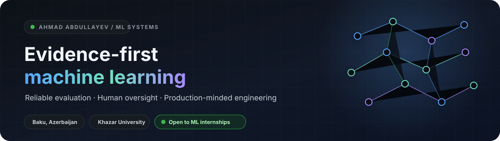
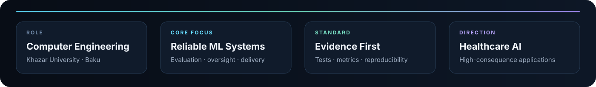
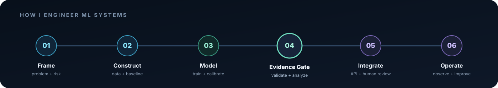
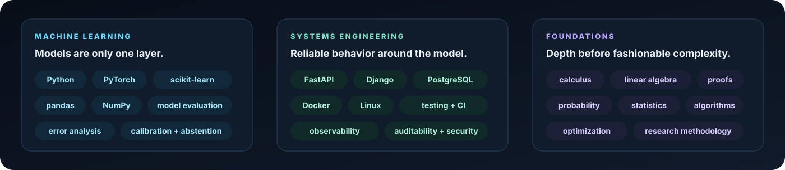
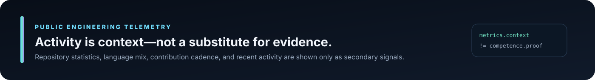
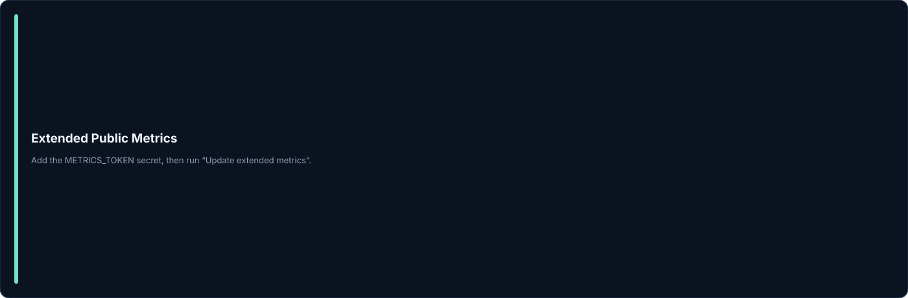

<div align="center">



<a href="https://git.io/typing-svg">
  
</a>

**Computer Engineering student building evidence-driven machine-learning systems and research-oriented software.**

Applied ML · evaluation systems · human-in-the-loop AI · production-minded Python

<a href="mailto:ehmedmanafoghlu@gmail.com">
  
</a>
<a href="https://github.com/ahmadabdullayew">
  
</a>
<a href="#selected-engineering-systems">
  
</a>


</div>

<br />



## Selected Engineering Systems

<table>
<tr>
<td width="50%" valign="top">

### 01 — [ASANAppeal AI](https://github.com/ahmadabdullayew/Asan-Appeal)

**Applied civic AI with explicit human oversight**

A structured complaint workflow spanning intake, institutional routing, urgency estimation, response verification, privacy controls, review queues, audit trails, and operational observability.

`FastAPI` `Applied ML` `Verification` `Privacy` `Human review`

**Status:** evolving implementation and evaluation system.

</td>
<td width="50%" valign="top">

### 02 — [EO Drought Intelligence](https://github.com/ahmadabdullayew/EO-Drought-Intelligence)

**Earth-observation intelligence for constrained decisions**

A modular prototype that converts satellite and environmental signals into drought analysis, temporal stress indicators, and irrigation-priority outputs.

`Geospatial ML` `EO data` `Analytics` `Pipelines` `Decision support`

**Status:** hackathon prototype moving toward empirical closure.

</td>
</tr>

<tr>
<td width="50%" valign="top">

### 03 — [Neural Branch-and-Bound](https://github.com/ahmadabdullayew/DBMS-Report)

**Learning-augmented optimization without surrendering exactness**

A research design for database physical design in which learned proposals support branching, pricing, cuts, and primal construction while deterministic gates preserve solver correctness.

`Optimization` `Branch-and-bound` `Exact algorithms` `Research design`

**Status:** formal technical report and experimental specification.

</td>
<td width="50%" valign="top">

### 04 — [Personal Academic Website](https://github.com/ahmadabdullayew/personal-academic-website)

**Reproducible engineering for an evidence-governed public portfolio**

A Django-based academic platform with structured architecture, testing contracts, documentation, traceability, content governance, and deployment controls.

`Django` `PostgreSQL` `TypeScript` `Testing` `Architecture`

**Status:** implementation foundation under active development.

</td>
</tr>
</table>

## Engineering Method



The **evidence gate** is the center of the workflow: leakage checks, validation design, calibration, error analysis, robustness testing, and explicit failure boundaries must justify integration.

## Capability Matrix



## Public Engineering Telemetry



<p align="center">
  
  
</p>

<details>
<summary><strong>Extended activity metrics</strong></summary>
<br />

</details>

<details>
<summary><strong>Contribution cadence</strong></summary>
<br />
<p align="center">
  
</p>
</details>

<sub>
These cards summarize public platform activity. They do not measure code quality, project ownership,
mathematical depth, system reliability, or research competence. The repositories above remain the primary evidence.
</sub>

<!--
OPTIONAL GITHUB TRENDS MODULE

GitHub Trends requires account authorization before its SVG endpoints reliably render for a user.
After completing optional/GITHUB_TRENDS_SETUP.md, place this block under the telemetry section:

<p align="center">
  <a href="https://githubtrends.io">
    
  </a>
  <a href="https://githubtrends.io">
    
  </a>
</p>
-->

## Current Frontier

<table>
<tr>
<td width="33%" valign="top">

### Building

- reproducible ML evaluation pipelines;
- accountable human-in-the-loop workflows;
- production-oriented Python services;
- clearer empirical evidence for flagship projects.

</td>
<td width="33%" valign="top">

### Studying

- proof-based mathematical foundations;
- probability, statistics, and optimization;
- learning-augmented algorithms;
- reliable AI in high-consequence domains.

</td>
<td width="33%" valign="top">

### Seeking

- machine-learning engineering internships;
- research collaborations;
- serious open-source contributions;
- projects where evaluation quality matters.

</td>
</tr>
</table>

## Evidence Standard

> **Every important claim should terminate in inspectable evidence: executable code, tests, metrics, reproducible commands, design decisions, demonstrated behavior, or explicitly documented limitations.**

```text
prototype    != production
activity     != competence
complexity   != rigor
architecture != evidence
confidence   != calibration
```

1. Frame the real decision problem before selecting a model.
2. Treat validation design as part of system architecture.
3. Prefer reproducible baselines over fashionable complexity.
4. Make uncertainty, abstention, and human escalation explicit.
5. Separate proposed, implemented, evaluated, deployed, and operated capabilities.
6. Engineer the surrounding software with the same rigor as the model.

### Additional Evidence Case Study

The
[breast-cancer-detection-portfolio](https://github.com/ahmadabdullayew/breast-cancer-detection-portfolio)
applies this evidence standard to a healthcare-adjacent machine-learning problem.
Its model card, evaluation protocol, data documentation, and limitations record
are maintained alongside the implementation rather than treated as retrospective
documentation.

<br />


