<p align="center">
  
</p>

<h1 align="center">Ahmad Abdullayev</h1>

<p align="center">
  <strong>Computer Engineering Student · Machine Learning Engineering · Software Systems</strong>
</p>

<p align="center">
  
</p>

<p align="center">
  
  
  
  
</p>

<p align="center">
  <a href="https://github.com/ahmadabdullayew">
    
  </a>
  <a href="https://www.linkedin.com/in/ahmad-abdullayev-826816289/">
    
  </a>
  <a href="mailto:ehmedmanafoghlu@gmail.com">
    
  </a>
  <a href="https://github.com/ahmadabdullayew/personal-academic-website">
    
  </a>
</p>

---

## About

I am a **Computer Engineering student at Khazar University** focused on building machine-learning systems that remain understandable, inspectable, and testable beyond the experimentation notebook.

My work sits at the intersection of **machine learning, software engineering, model evaluation, and system design**. I am particularly interested in engineering workflows where model outputs are accompanied by explicit validation, provenance, uncertainty handling, human review, and reproducible evidence.

I currently build and study systems involving:

- applied machine-learning services;
- reproducible model evaluation and acceptance gates;
- human-in-the-loop AI workflows;
- local-first and privacy-aware AI architectures;
- research-oriented engineering prototypes;
- optimization and learning-augmented algorithms;
- reliable Python software boundaries and testing.

My technical direction is deliberately broader than model training alone: I want to understand how intelligent components interact with **data, software architecture, evaluation methodology, users, operational constraints, and failure modes**.

### Open to

- Machine Learning Engineering internships
- AI Engineering internships
- Research Engineering opportunities
- Applied ML collaborations
- Rigorous open-source engineering

---

## Tech Stack

### Languages

<p>
  
</p>

### Frontend

<p>
  
</p>

### Backend & Databases

<p>
  
</p>

### Cloud, DevOps & Tooling

<p>
  
</p>

---

## AI / ML Expertise

<p>
  
  
  
  
</p>

| Domain | Evidence / Level | Technologies & Methods | Representative Work |
| --- | --- | --- | --- |
| **Classical Machine Learning** | Applied / project experience | Classification, feature engineering, structured inference, scikit-learn-style workflows | [ASANAppeal AI](https://github.com/ahmadabdullayew/Asan-Appeal) |
| **Model Evaluation & Verification** | Project experience | Acceptance gates, calibration sweeps, regression datasets, mismatch analysis, human-review fallback | [ASANAppeal AI](https://github.com/ahmadabdullayew/Asan-Appeal) |
| **Earth Observation ML** | Project experience | EO/environmental data, preprocessing, feature engineering, temporal analysis, drought intelligence | [EO Drought Intelligence](https://github.com/ahmadabdullayew/EO-Drought-Intelligence) |
| **Deep Learning** | Foundational / coursework | Neural-network foundations, PyTorch-oriented learning | [Machine Learning Coursework](https://github.com/ahmadabdullayew/holbertonschool-machine_learning) |
| **Learning-Augmented Optimization** | Research / technical-report exposure | Branch-and-bound, column generation, cutting planes, deterministic acceptance gates | [Neural Branch-and-Bound](https://github.com/ahmadabdullayew/DBMS-Report) |

The emphasis is on **evidence-backed engineering depth rather than self-assigned proficiency percentages**.

---

## Featured Projects

<details open>
<summary><strong>ASANAppeal AI</strong> — Reviewable civic-AI workflow with local-first execution</summary>

<br>

A runnable backend foundation for converting citizen complaints and supporting evidence into a structured workflow covering intake, institutional routing, priority assessment, appeal drafting, response verification, explanation, and human review.

| Dimension | Details |
| --- | --- |
| **Stack** | Python · FastAPI · SQLite |
| **Architecture** | Intake → Routing → Priority → Drafting → Verification → Explanation → Human Review |
| **Execution Model** | Local zero-key mode with optional Ollama, Gemini, and OpenAI provider paths |
| **Validation** | Gold regression datasets, task-level metrics, acceptance gates, threshold-calibration sweeps, mismatch artifacts |
| **Reliability / Security** | Role-based authorization, append-only hash-linked audit records, privacy controls, abuse protection, structured observability |
| **Repository** | [github.com/ahmadabdullayew/Asan-Appeal](https://github.com/ahmadabdullayew/Asan-Appeal) |
| **Maturity** | Runnable backend foundation; not presented as an externally validated production deployment |

### Engineering design

The system decomposes the AI workflow into explicit services rather than treating a single model call as the application architecture.

Uncertain or operationally sensitive decisions can be routed toward **manual review**, while model/provider provenance is retained at the case level.

The repository also includes a built-in evaluation path for intake, routing, priority, and verification. Evaluation outputs include task metrics, acceptance decisions, calibration sweeps, and mismatch samples intended to make regressions inspectable.

The local execution path combines durable SQLite persistence, locally backed classification/reasoning components, evidence handling, lifecycle enforcement, and review workflows without requiring a hosted-model API key.

</details>

<details>
<summary><strong>EO Drought Intelligence</strong> — Earth-observation drought and irrigation decision support</summary>

<br>

A hackathon prototype designed to transform Earth-observation and environmental signals into drought analysis, temporal stress indicators, and irrigation-priority information.

| Dimension | Details |
| --- | --- |
| **Stack** | Python · Earth Observation data · Environmental data · ML pipelines |
| **Architecture** | Ingestion → Processing → Analytics → ML → Pipelines → Interfaces |
| **Technical Focus** | Vegetation/moisture indicators, temporal analysis, feature engineering, drought scoring |
| **Repository** | [github.com/ahmadabdullayew/EO-Drought-Intelligence](https://github.com/ahmadabdullayew/EO-Drought-Intelligence) |
| **Maturity** | Hackathon prototype with a layered, production-minded architecture |

### Engineering design

The project avoids a notebook-only structure by separating domain concepts and processing stages into explicit modules for:

- configuration;
- domain models;
- data ingestion;
- preprocessing;
- feature engineering;
- analytics;
- datasets;
- models;
- training;
- evaluation;
- inference;
- model metadata;
- end-to-end pipelines;
- command-line interfaces.

The goal is to preserve a clear transition from raw environmental signals to interpretable decision-support outputs while keeping experimentation, evaluation, and inference structurally separated.

</details>

<details>
<summary><strong>Neural Branch-and-Bound Accelerator</strong> — Learning-augmented exact database physical design</summary>

<br>

A formal technical report exploring how learned proposals can accelerate an exact database physical-design optimizer without allowing machine-learning components to invalidate solver correctness.

| Dimension | Details |
| --- | --- |
| **Artifact** | Formal technical report |
| **Problem** | Joint index, materialized-view, and partition selection under budget and compatibility constraints |
| **Optimization Methods** | Mixed-integer optimization · Branch-and-bound · Column generation · Cutting planes |
| **Learning Role** | Advisory proposals for branching, cuts, pricing, and primal construction |
| **Correctness Boundary** | Deterministic acceptance gates and certificate verification remain authoritative |
| **Repository** | [github.com/ahmadabdullayew/DBMS-Report](https://github.com/ahmadabdullayew/DBMS-Report) |

### Engineering design

The central design principle is that learned components can improve **proposal quality** without becoming correctness-critical authorities.

Operations affecting bounds or pruning remain subject to deterministic verification. This preserves the semantic distinction between:

> learning that guides search

and

> mechanisms that establish exactness.

The report also defines an empirical closure framework covering benchmark design, fairness, metrics, ablation, robustness, and repeatability.

</details>

<details>
<summary><strong>Personal Academic Website</strong> — Evidence-governed academic and professional web platform</summary>

<br>

An implementation foundation for a personal academic website designed around explicit content provenance, quality gates, traceability, and controlled publication of personal or academic claims.

| Dimension | Details |
| --- | --- |
| **Stack** | Django · TypeScript · Vite · PostgreSQL |
| **Architecture** | Server-rendered Django frontend · REST API · PostgreSQL persistence · asynchronous-worker design |
| **Engineering Controls** | Formatting · linting · strict typing · tests · migration checks · OpenAPI validation · build checks |
| **Infrastructure Design** | AWS-oriented deployment architecture using CloudFront, WAF, ALB, ECS, RDS, S3, and SQS |
| **Security / Integrity** | Secret-management boundaries, controlled publication states, isolated storage boundaries, governance records |
| **Repository** | [github.com/ahmadabdullayew/personal-academic-website](https://github.com/ahmadabdullayew/personal-academic-website) |
| **Maturity** | Implementation foundation with documented production architecture; deployment design is not treated as proof of production operation |

### Engineering design

The repository treats content claims, architecture decisions, requirements, and release checks as inspectable engineering artifacts.

Its local development contract includes reproducible Python and Node environments together with formatting, linting, typing, testing, migration, OpenAPI, build, and cross-artifact validation commands.

The architecture deliberately separates the implemented foundation from the documented production deployment target, avoiding the assumption that an architecture diagram itself proves deployment or operational maturity.

</details>

---

## GitHub Analytics

GitHub analytics below describe **repository activity and repository-language composition**. They are not proficiency, seniority, or engineering-quality scores.

<p align="center">
  <a href="https://github.com/ahmadabdullayew">
    
  </a>
</p>

<p align="center">
  <a href="https://github.com/ahmadabdullayew?tab=repositories">
    
  </a>
</p>

<p align="center">
  <a href="https://github.com/ahmadabdullayew">
    
  </a>
</p>

---

## Contribution Activity

<p align="center">
  <a href="https://github.com/ahmadabdullayew?tab=overview">
    <picture>
      <source
        media="(prefers-color-scheme: dark)"
        srcset="./profile/contributions-dark.svg"
      />
      <source
        media="(prefers-color-scheme: light)"
        srcset="./profile/contributions-light.svg"
      />
      
    </picture>
  </a>
</p>

<p align="center">
  <sub>Real GitHub contribution data · automatically refreshed</sub>
</p>

---

---

## Current Focus

```yaml
current_focus:
  learning:
    - proof-based mathematics
    - probability and statistics
    - optimization and algorithms

  building:
    - reproducible machine-learning evaluation
    - human-in-the-loop AI workflows
    - production-minded Python systems

  exploring:
    - AI in medicine
    - reliable intelligent systems
    - learning-augmented optimization

  open_to:
    - machine learning engineering internships
    - AI engineering internships
    - research engineering collaboration
    - rigorous open-source work
