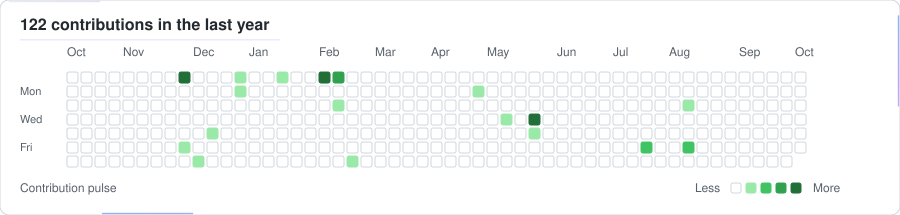

# Ahmad Abdullayev

**Computer Engineering · Python & machine-learning systems · Baku, Azerbaijan**

I build inspectable AI workflows, evaluation tooling and Python systems. My work focuses on **what a system can demonstrate**: source code, reproducible checks, and explicit limits.

**Selected work:** [ASANAppeal AI](https://github.com/ahmadabdullayew/Asan-Appeal) · [Bahar](https://github.com/ahmadabdullayew/Bahar) · [EO Drought Intelligence](https://github.com/ahmadabdullayew/EO-Drought-Intelligence) · [Optimization study](https://github.com/ahmadabdullayew/DBMS-Report)

[Featured projects](#featured-projects) · [Project evidence](./PROJECT_EVIDENCE.md) · [Technical CV](./CV.md) · [Contact](#connect)

---

## About

I'm a Computer Engineering student at **Khazar University** interested in reliable ML systems, experiment design, computer vision, and autonomous systems. The projects below link to public implementations or a technical report; publication alone does not verify production readiness or individual authorship.

## Featured Projects

**Four selected artifacts, ordered by relevance and inspectable evidence.** Project sources and documentation were reviewed on **10 October 2026**. For detailed methods and limitations, see the [evidence index](./PROJECT_EVIDENCE.md).

### ASANAppeal AI — Civic-AI intake and evaluation

`Python` · `FastAPI` · `Evaluation`

**Problem:** Help organize and route civic complaints while keeping uncertain automated decisions reviewable. **Implementation:** Python services for intake, routing, priority, and verification, with [task datasets](https://github.com/ahmadabdullayew/Asan-Appeal/tree/main/data/evals) and [evaluation/threshold code](https://github.com/ahmadabdullayew/Asan-Appeal/blob/main/app/evaluation.py).

**Outcome and limit:** Testable backend foundation, **not an independently validated production service**. Accuracy and calibration have **not been independently reproduced here**; individual code authorship remains unverified.

**Reproduce / inspect:** [Source and setup](https://github.com/ahmadabdullayew/Asan-Appeal#run-locally) · [Tests](https://github.com/ahmadabdullayew/Asan-Appeal/tree/main/tests) · [Evaluation tests](https://github.com/ahmadabdullayew/Asan-Appeal/blob/main/tests/test_evaluation.py)

### Bahar Operations — Evidence-governed food-label assessment

`Python` · `Rules` · `Human review`

**Problem:** Surface recipe-to-label inconsistencies without treating automated findings as regulatory approval. **Implementation:** [Deterministic lexical engine](https://github.com/ahmadabdullayew/Bahar/blob/main/src/bahar_ai_core/engine.py), provenance and review workflows, and a [local demonstration](https://github.com/ahmadabdullayew/Bahar/blob/main/demo/bahar-demo.mp4).

**Outcome and limit:** The repository's [verification report](https://github.com/ahmadabdullayew/Bahar/blob/main/docs/F49-F56_VERIFICATION_SUMMARY.md) records **136 passed, 5 skipped** (repository-reported, not independently reproduced here). The reference vocabulary is editorial and the baseline **untrained**; no food-safety or production qualification is claimed.

**Reproduce / inspect:** [Source and setup](https://github.com/ahmadabdullayew/Bahar#run-the-full-localhost-system) · [Tests](https://github.com/ahmadabdullayew/Bahar/tree/main/tests) · [Known limitations](https://github.com/ahmadabdullayew/Bahar/blob/main/docs/F28-F38_INPUT_AI_REMEDIATION.md)

### EO Drought Intelligence — Earth-observation ML prototype

`Python` · `Environmental data` · `ML pipeline`

**Problem:** Explore drought stress and irrigation prioritization using environmental signals. **Implementation:** [Data/ML modules](https://github.com/ahmadabdullayew/EO-Drought-Intelligence/tree/main/eo_drought) alongside [unit](https://github.com/ahmadabdullayew/EO-Drought-Intelligence/tree/main/tests/unit), [integration](https://github.com/ahmadabdullayew/EO-Drought-Intelligence/tree/main/tests/integration), and regression checks.

**Outcome and limit:** Source-available **hackathon prototype**, not a validated irrigation-decision service. Field performance, savings and fresh-environment reproducibility remain unverified.

**Reproduce / inspect:** [Repository](https://github.com/ahmadabdullayew/EO-Drought-Intelligence) · [Test suite](https://github.com/ahmadabdullayew/EO-Drought-Intelligence/tree/main/tests) · [Regression tests](https://github.com/ahmadabdullayew/EO-Drought-Intelligence/tree/main/tests/regression)

### Neural Branch-and-Bound Accelerator — Optimization research study

`Formal modeling` · `Exact search` · `Research report`

**Research question:** Can learning-guided database physical-design search retain exactness when learned proposals are checked by deterministic acceptance rules?

**Outcome and limit:** A [formal technical report](https://github.com/ahmadabdullayew/DBMS-Report/blob/main/docs/DBMS.pdf) develops the model and evaluation protocol; it is **not a verified executable optimizer**. No measured speedup, completed baseline evaluation, or independently reviewed proof is claimed.

**Reproduce / inspect:** [Report repository](https://github.com/ahmadabdullayew/DBMS-Report) · [Read the PDF](https://github.com/ahmadabdullayew/DBMS-Report/blob/main/docs/DBMS.pdf)

**Additional engineering work:** [Personal Academic Website — source repository](https://github.com/ahmadabdullayew/personal-academic-website), a web-platform implementation foundation; **not a deployed website**.

## ML Experience and Research

- **Demonstrated in public source:** Python services, evaluation code, test automation, and structured rule-based processing — [ASANAppeal](https://github.com/ahmadabdullayew/Asan-Appeal/tree/main/app) · [Bahar](https://github.com/ahmadabdullayew/Bahar/tree/main/src).
- **Research/technical study:** Exact optimization and a proposed evaluation framework — [branch-and-bound report](https://github.com/ahmadabdullayew/DBMS-Report/blob/main/docs/DBMS.pdf); not a measured solver result.
- **Learning direction:** Probability, optimization, computer vision, reinforcement learning and autonomous systems — goals, not completed research outcomes.

**Individual code authorship** has not been confirmed by an independent contribution audit. [Inspect the skill-to-source evidence matrix](./PROJECT_EVIDENCE.md#skills-and-source-traceability).

## Technical Foundation

**Directly evidenced:** `Python` · `FastAPI` · testing/evaluation · structured data processing · rule-based pipelines · Git. Project manifests and source also contain `SQLite`, `SQLAlchemy`, `NumPy` and `scikit-learn`; listing a dependency does not itself prove mastery. [Trace technologies to code](./PROJECT_EVIDENCE.md#skills-and-source-traceability).

## GitHub Activity

**Static contribution snapshot**, not a measure of engineering ability. [Read the date-by-date text summary](./profile/contributions-summary.md) or [view current GitHub activity](https://github.com/ahmadabdullayew?tab=overview). Archived snapshots can be stale.

  <a href="https://github.com/ahmadabdullayew?tab=overview">
    <picture>
      <source media="(max-width: 640px) and (prefers-color-scheme: dark)" srcset="./profile/contributions-mobile-dark.svg" />
      <source media="(max-width: 640px)" srcset="./profile/contributions-mobile-light.svg" />
      <source media="(prefers-color-scheme: dark)" srcset="./profile/contributions-dark.svg" />
      
    </picture>
  </a>

## Current Focus

**Building:** Reviewable AI tools and reproducible evaluations. **Studying:** ML theory, computer vision and robotics. **Open to:** ML/AI engineering internships and research-oriented collaboration.

## Connect

[Technical CV](./CV.md) · [Project evidence index](./PROJECT_EVIDENCE.md) · [GitHub](https://github.com/ahmadabdullayew) · [LinkedIn](https://www.linkedin.com/in/ahmad-abdullayev-826816289/) · [Email](mailto:ehmedmanafoghlu@gmail.com)
